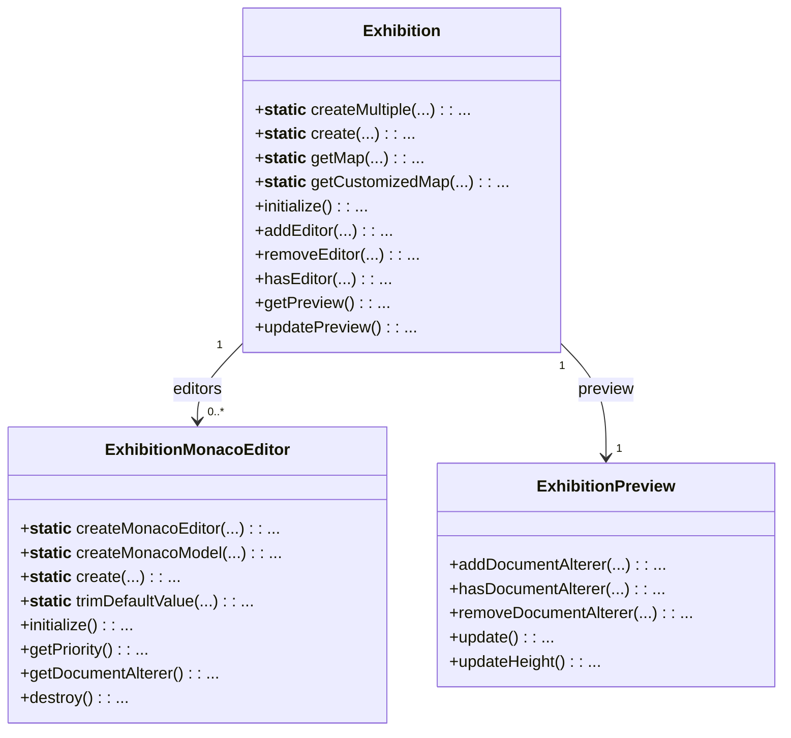
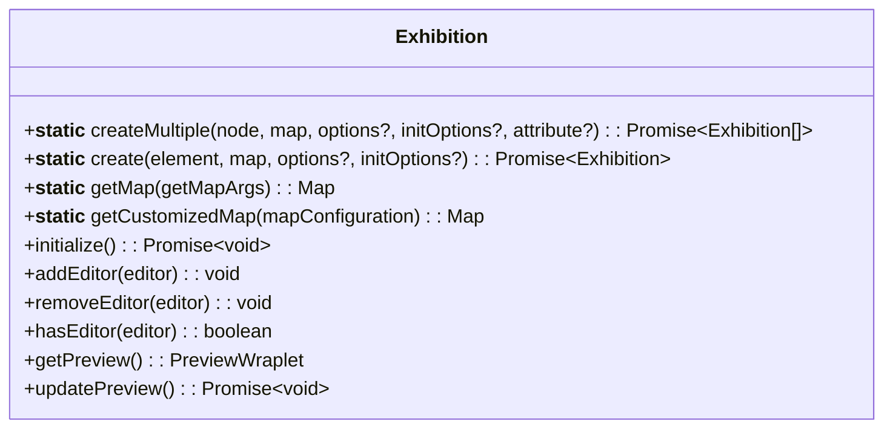
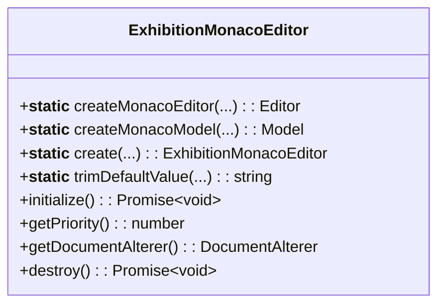
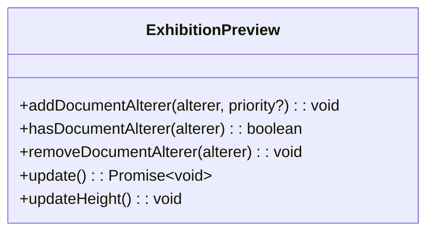

## Diagram



## Exhibition



An `Exhibition` class coordinates a group of editors and a single preview. It automatically
finds properly configured elements among its children and wires them up. It's not strictly
necessary, you can instantiate a preview, a bunch of editors and wire them up yourself. However,
`Exhibition` class makes setting everything up a bit easier.

### Map

Exhibtion's `create` methods require a dependency map. Based on this map Exhibition class decides
what and how to instantiate among its children.

`getMap` method provides a default map with the options structure suitable for most use cases.

If that's not enough, you can provide your own map, where you can completely customize everything.
You can even provide your custom classes that will be instantiated as Editors and Preview. A good
starting point to that is to use the `getCustomizedMap` method that is equipped with useful types.

## Editors



Editors are instances that provide a `DocumentAlterer` (see below) function. The provided
`ExhibitionMonacoEditor` class wraps a Monaco Editor instance and uses its value as a return value
of provided `DocumentAlterer`.

## Preview



The Preview is an iframe controlled by the `ExhibitionPreview` class. When updated, it creates a
fresh HTML document, sorts all alterers by priority (descending), executes them, and loads their
output into the iframe. The preview automatically resizes to fit its content (this behavior can be
disabled).

## DocumentAlterer

A `DocumentAlterer` is an async function that receives the target `Document` and mutates it
(e.g., appends HTML, scripts, styles). You can create your own alterers to inject anything you need.

```ts
import type { DocumentAlterer } from "exhibitionjs";

const addMeta: DocumentAlterer = async (doc) => {
  const meta = doc.createElement("meta");
  meta.name = "viewport";
  meta.content = "width=device-width, initial-scale=1";
  doc.head.appendChild(meta);
};

exhibition.addPreviewAlterer(addMeta, 10); // higher number runs earlier
```

## Priorities

Alterers have a numeric priority. Higher numbers run first. This lets you control ordering (e.g., ensure polyfills load before your demo script).
